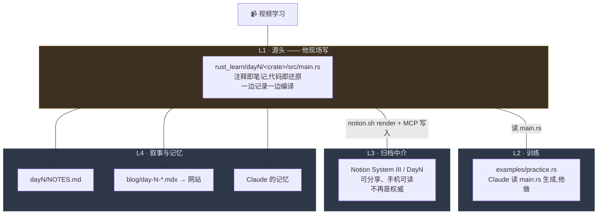
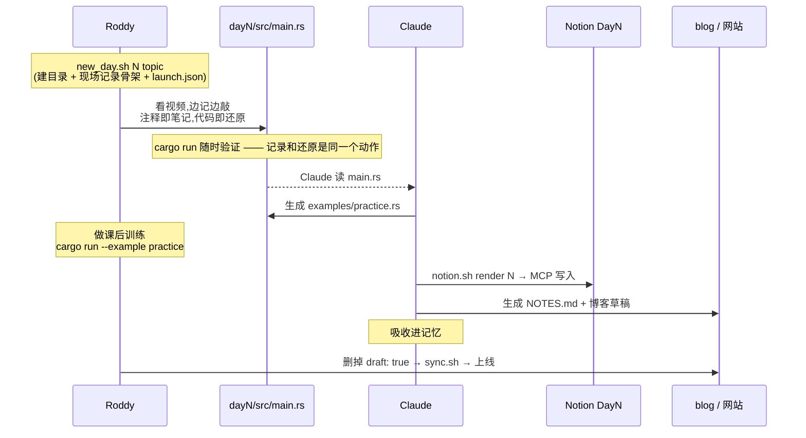

# 每日学习管道 · 架构说明

> 这份文档说的是**为什么**存在这条管道,以及它由哪几层构成。
> 「博客怎么用」在 [README.md](./README.md),「Rust 怎么学」在 [rust_learn](https://github.com/RoddyH17/rust_learn)。

---

## 1. 为什么存在

这条管道不是为了「把笔记同步到三个地方」。同步只是副产品。真正的目标有两个:

**① 让 AI 拥有一套关于「我在学什么」的记忆系统。**
AI 需要知道我每天在学什么、卡在哪、想通了什么,才能在后续对话里接得上,而不是每次
从零问起。散落在 Notion 里的原始笔记做不到这件事——它没有结构,没有时间轴,也没有
「这一天到底完成了没有」的判定。

**② 让每天的知识变成可再利用的素材。**
现在有大量 AI 视频/内容工具。我希望能灵活调用自己每天的动态,并且**直接从博客就能
看出当天的亮点与特色**。

> 例:今天学了 Rust 的 Ownership。这套抽象范式能不能映射到生活里的例子,做成一个
> 更好懂的 exemplify?「所有权只能有一个持有者,转移之后原持有者失效」——这跟房产
> 过户、跟借书证、跟接力棒有什么异同?
>
> 这类玩法还有很多,但前提是**每天的材料必须以机器能直接消费的形态存在**。

所以有一条贯穿全文的原则:

> **这条管道的产物,首要读者是 AI,其次才是人。**

人读的部分(博客正文)已经有了。缺的是 AI 读的部分——这就是下面 L4 那一层。

---

## 2. 四层架构



| 层                                | 是什么                                                                               | 谁写               | 状态    |
| --------------------------------- | ------------------------------------------------------------------------------------ | ------------------ | ------- |
| **L1** `dayN/<crate>/src/main.rs` | **唯一源头**。看视频时现场写:注释是笔记,代码是对老师内容的还原,随时 `cargo run` 验证 | **Roddy**          | ✅ 在用 |
| **L2** `examples/practice.rs`     | 课后训练。Claude 读完 L1 生成题目                                                    | Claude 生成 / 他做 | ✅ 在用 |
| **L3** Notion System III / DayN   | **归档中介**:可分享、手机可读、长期沉淀。**不再是信息源**                            | Claude 推送        | ✅ 在用 |
| **L4** `NOTES.md` / 博客 / 记忆   | 叙事与再利用                                                                         | Claude 生成        | ✅ 在用 |

### 2026-08-07:Notion 从信息源降级为中介

原架构是 **Notion → rust_learn / blog**,Notion 是 source of truth。Roddy 重新定义了它:

> 「所以现在我重新思考了一下 notion 的位置,它并非作为信息源,而是信息中介和数据管道。」

**方向整个反了。** 现在的源头是他在 VSCode 里现场敲的那个 `main.rs` —— 因为学习本身
就发生在那里:看视频、记笔记、把老师的代码敲出来跑通,是同一个动作。让这个动作的产物
直接当源头,中间就没有任何一步会丢东西。

Notion 仍然重要 —— 它是可分享、手机上能翻、能长期沉淀的那一份。但它现在**从 L1 生成**,
而不是反过来。

### 三层现在共用一条切分轴:天

**2026-08-06 起,Notion 也按天切**——Roddy 把 Day 1/2/3 拆成了 System III 下的三个
子页面。三层从此同构,`audit` 之所以能做,就是因为三边可以逐天对齐。

原先 L1 是按主题(章/节)切的,理由写在
[`src/content.config.ts`](./src/content.config.ts) 里(research 集合那段注释):

> posts 是时间流、是写完就定稿的;research notes 是一个会被反复修订几个月的矩阵。

按那个分类,System III 更像后者,所以本文档原先建议**不要**按天拆。改了之后换来的是
一个明显更结实的 join key(见下一节),这笔交易是划算的。

**但代价要记在这里,免得以后忘**:到第 60 天,「借用规则怎么写来着」会变成
「那是第几天学的来着」。等日页多到查不动时,解法是在父页维护一份**主题索引**
(概念 → 哪一天),而不是把日页再拆回主题结构。

---

## 3. 日号由 `dayN/` 目录决定

源头是文件系统:`rust_learn/day4/` 存在,Day 4 就存在。Notion 的 `Day4: …` 子页是它的
投影,不是它的定义。

### 契约

1. **`dayN/` 目录名就是日号。** `audit` 枚举 `rust_learn/day*/` 来决定要查哪几天。
2. **一天一个 crate**:`dayN/<topic>/`,`src/main.rs` 是现场记录,
   `examples/practice.rs` 是训练。`new_day.sh` 一条命令建好,含 `.vscode/launch.json`。
3. **现场记录的结构约定**(`render` 靠它解析):
   - `//!` 开头的模块文档 → 当天导语(Markdown,rust-analyzer 悬停可渲染)
   - `// ---------- N. 标题 ----------` → 一个小节
   - 小节里,**第一行代码之前**的整行注释算散文,之后的全部算代码(含行内注释)——
     因为代码前的注释通常是「老师说 / 我的理解」,穿插在代码里的是在解释那几行本身
4. **日号只在章内唯一。** 开 Chapter 2 时会重新从 Day 1 开始,真正的标识是 (章, 日)。
   命令行写 `day 2.3`;第 1 章可省略。**跨章的目录约定尚未决定** —— `audit` 遇到第 2 章
   会直接报「尚无目录约定」,不替人发明。

### 往 Notion 里写什么 —— 两条硬规则

**① 不放练习。** 练习在 `practice.rs` 里做,Notion 再放一份就是重复。往 Notion 放的是:
解释、中英文对照解释、细致知识点、对笔记的总结。🌟 分级同理,只属于 `practice.rs`。

**② 一个大标题,底下逐条列重点。** 不要 `###` / `####` 堆成多层树 —— 用加粗编号引导句

- 代码 + 表格把要点一条条列出来。

中英文分工:**英文承载 The Rust Book 的参考文本,中文承载他自己的理解。** 原样保留,
`render` 不翻译不改写。

### 读和写走两条不同的路

| 方向             | 用什么                                                      | 为什么                               |
| ---------------- | ----------------------------------------------------------- | ------------------------------------ |
| **读**(回读校验) | `scripts/notion.sh fetch` + `.env` 里的只读 token           | 不进上下文,成本固定                  |
| **写**(推送内容) | `notion.sh render <N>` 渲染 → MCP `notion-update-page` 写入 | 脚本那个 integration **只读,写不了** |

`render` 负责把 `main.rs` 变成符合上面两条硬规则的 markdown 并校验;实际写入必须走 MCP。

## 4. 一天的生命周期



**为什么源头是 `main.rs` 而不是别的:** 学习这件事本身就发生在编辑器里 —— 看视频、
记笔记、把老师的代码敲出来跑通,是同一个动作。让这个动作的产物直接当源头,中间就没有
任何一步会丢东西。以前 Notion 当源头时,漏的永远是「记在 Notion 里但没流到下游」那一段。

## 5. 「一天算完成」的定义

以 `dayN` 的现场记录为参照,五项齐全才算完成:

| 检查项       | 判据                                                                                        |
| ------------ | ------------------------------------------------------------------------------------------- |
| **main.rs**  | 编号节都写了内容,且 `cargo run` 通过                                                        |
| **practice** | `examples/practice.rs` 有真题目(不是 TODO 骨架),`cargo run --example practice` **原样通过** |
| **Notion**   | System III 下有对应的 DayN 页,内容与 `render` 输出一致                                      |
| **NOTES.md** | `dayN/NOTES.md` 写完(Goals 表学前填,其余学后填)                                             |
| **blog**     | `src/content/posts/rust/day-N-*.mdx` 存在且已发布(无 `draft: true`)                         |

跑 `./scripts/notion.sh audit` 得到这张表 —— **不要手抄,它会过期**。

`audit` 的三条硬规则:

- **查文件系统,不查 git。**「存在但未提交」和「不存在」是两种状态,分开报。
- **不做假的覆盖率。** 源头与 Notion 的标题不同源,做相似度匹配只会给出虚假的精确感。
  并排列出两边小节,标「需人工判断」,不出百分比。
- **真的编译。** `main.rs` 和 `practice.rs` 都跑 `cargo build`,不只查文件存在 ——
  这是「原样可编译」那条铁律唯一可靠的检查方式。

## 6. L4 · 再利用层(🚧 提案,未实现)

前三层都是「存放」。第四层是「抽取」——它要回答的问题是:

> **每天除了笔记和文章,还应该额外产出什么,才能让 AI 直接消费?**

### 形状:博客文章 frontmatter 上的再利用钩子

```yaml
---
title: Day 3 · Ownership — 谁负责释放这块内存
pubDate: 2026-08-06
categories: [rust]
mood: [sorge, frage]

# ── L4 再利用钩子 ──────────────────────────────
# 当天的核心抽象。AI 用它判断"这天讲了什么"
concepts: [ownership, move, borrow, NLL, dangling-reference]

# 一句话说清当天最反直觉的点 —— 视频/类比生成的种子
hook: '把一个变量赋值给另一个,原变量当场失效 —— 赋值是转移,不是拷贝'

# 已经想到的生活类比。可以留空,由 AI 补
analogies:
  - '房产证只能有一个持有人;过户之后,原持有人不再有权处置那套房'
  - '借出去的书:借阅期间你不能再借给第二个人,也不能把书卖掉'
---
```

### 为什么放 frontmatter,而不是单独的 index.json

沿用 research 集合已经确立的模式(见 `src/content.config.ts` 里 `sources[]` /
`deepwiki[]` 那段注释):**出处放 frontmatter,正文改了也不脱节。**

具体到这里:

- 博客本来就要按天写。钩子跟着文章走,**一次编辑同时喂人和喂 AI**
- 不产生第二个需要同步的地方——多一个 index.json 就多一处会漂移的真相
- Astro 的 `getCollection('posts')` 一次调用就能拿到全部钩子,渲染和消费都免费

### 这一层解锁什么

| 能力                           | 靠哪个字段                           |
| ------------------------------ | ------------------------------------ |
| AI 知道我这周学了什么          | `concepts` 按天聚合                  |
| 「今天这个概念,能类比成什么」  | `hook` 当种子,`analogies` 当已有积累 |
| 生成短视频脚本 / 讲解稿        | `hook` + 正文 + `practice.rs` 的题目 |
| 博客上直接看出当天亮点         | `hook` 渲染成文章卡片的副标题        |
| 找出「学过但从没复用过」的概念 | `concepts` 出现过但 `analogies` 为空 |

> **状态:提案。** 本文档只立靶心,`src/content.config.ts` 尚未改动,现有文章也还
> 没有这些字段。

---

## 7. 脚本清单

### rust_learn(`~/rust_learn`)—— 源头这一侧

| 脚本                                   | 职责                                                                                                                |
| -------------------------------------- | ------------------------------------------------------------------------------------------------------------------- |
| `new_day.sh <N> [topic] [slug] [date]` | 建 `dayN/` + cargo 项目 + **现场记录骨架** + practice 骨架 + NOTES.md,并自动写入 `.vscode/launch.json` 两条调试配置 |
| `sync.sh ["msg"]`                      | commit + push                                                                                                       |

`new_day.sh` 产出的 `src/main.rs` 不是 cargo 默认的 hello world,而是带 `//!` 头
(日期 / 主题 / 待填主线)和编号空节的骨架,**打开就能往里写,而且原样可编译**。

### blog(`~/blog`)—— 生成这一侧

| 脚本                               | 职责                                                                           |
| ---------------------------------- | ------------------------------------------------------------------------------ |
| `scripts/notion.sh`                | `list` / `fetch` / `day` / `diff`(读) · `render`(渲染待推内容) · `audit`(对账) |
| `scripts/notion_sync.py`           | 上者的实现:Notion REST 拉取、block→markdown、现场记录解析、对账。仅标准库      |
| `scripts/deepwiki.sh`              | DeepWiki 检索层(research 管道用)                                               |
| `new_post.sh <类别> <slug> [标题]` | 新建博客草稿(`.mdx`,默认 `draft: true`)                                        |
| `new_research.sh`                  | 新建协议研究笔记                                                               |
| `sync.sh ["msg"]`                  | commit + push,触发 GitHub Actions 部署                                         |

```bash
./scripts/notion.sh render 4     # dayN 现场记录 → 待推 Notion 的 markdown
./scripts/notion.sh audit        # 五层对账,以 dayN 为参照
./scripts/notion.sh audit 4      # 只看某一天
```

缓存在 `.cache/notion/`(已 gitignore),每页一份 `.md` / `.json` / `.prev.md`,
外加 `meta.json`。页面改名会换 slug,`fetch` 自动清理孤儿文件。

### 一条贯穿的原则:检索层不是结论层

这句话写在 `scripts/deepwiki.sh` 顶部,对整条管道同样成立:

> DeepWiki 是检索层,不是结论层。它答出来的东西必须回原始源码核对再写进笔记。

对应到这里 —— **渲染、对账、diff 是确定性的,交给脚本;「这一节讲的是什么」
「哪道题值得出」需要判断,由 Claude 做。** 混淆这两者,就会得到一个看起来自动、
实际上悄悄写错的管道。

## 8. 已知约束

### 认证:已打通(2026-08-06)

Notion MCP 走的是 Claude 这边的 OAuth,脚本用不了。因此建了一个 internal
integration,凭据放在 `~/blog/.env`(已被 `.gitignore` 忽略):

```
NOTION_TOKEN=ntn_...
NOTION_SYSTEM_III_ID=3995432c-88e6-80cf-8319-d77f1bc72634
```

**权限范围:只共享了 System III 一个页面**(2026-08-06 用 `/v1/search` 验证,
返回且仅返回该页)。将来要接别的页面,得在 Notion 里逐个把页面共享给这个
integration——父页共享会级联到子页。

连通性验证结果:整页递归走完 **444 个 block,29 次 API 调用**,43 个标题层级完整。

> **为什么这件事值得做:** MCP 的返回一定会进上下文。System III 现在 50K 字符
> ≈ 15–20K tokens,每次取数都要付,而且逐日增长。脚本落盘则是零上下文成本,
> 之后只读需要的切片(单天约 600 tokens),**不随页面增长**。

### 解析:REST API 返回结构化 block,不是 HTML

用 `/v1/blocks/{id}/children` 递归拉取,拿到的是 typed block JSON,代码块是独立的
`code` 类型、`plain_text` 原样保留。所以**在这条路径上不存在剥标签/反转义的问题**,
不需要任何 HTML 清洗。已验证 `if n < 10 && n > -10` 在 67 个 code block 中完整保留。

⚠️ 但那个坑对**另一个源**依然成立:抓 [Rust By Practice](https://practice-rust-zh.beatai.org/)
的题目时拿到的是 HTML,**必须先剥标签再反转义实体**,顺序反了 `<[^>]+>` 会把
`if n < 10 && n > -10` 整段吃掉。两个源两套处理,别混。

### 解析:图片 URL 必须剥掉签名串

Notion 托管的图片是 S3 签名链接,**每次拉取签名都不一样**。若原样写进缓存,每跑一次
`fetch`,`diff` 就会把这些行全报成「改动过」(Day3 有 7 张图 = 每次 7 行假差异,
`diff` 永远安静不下来)。

所以转换时剥掉 `?` 后的查询串,只留稳定路径,并在下一行留 `<!-- notion-block: <id> -->`。
代价是缓存里的图链**不能直接访问**;要真的用图,拿 block id 回 Notion 换新链接。

### 解析的真实工作量(已完成)

REST API 不返回 markdown,转换器要自己写:16 种 block、富文本标注(inline code 出现
210 次,最高频)、`has_children` 递归、表格的 `has_column_header`、以及遇到
`child_page` 必须停止递归。实际约 330 行,落在 `scripts/notion_sync.py`,仅用标准库。

### 检索:wiki 型 database 的搜索是坏的

Roddy's Wiki 是 wiki 型 database,`notion-search` 带 `data_source_url` 参数时
**恒返回空结果**。要用 `notion-query-data-sources` 走 SQL:

```
collection://1d35432c-88e6-80f2-9c31-000bb9d9e9f0
```

(2026-08-06 验证)

### 体积:拆页之后不再是问题

拆页前 System III 是一整页 50K 字符,单次 `notion-fetch` 就超出一次工具响应上限。
拆成日页之后,最大的一页(Day3)是 12.7K 字符,而且 `fetch` 按页比对
`last_edited_time`,平时只重拉当天那一页。

**Token 账**:改版前每次取数 ≈ 15–20K tokens 且逐日增长;现在 `notion.sh day 3`
读一页缓存,成本固定,且不随全库增长。

---

## 9. 下一步

1. ~~管道反转:源头改为 `dayN/src/main.rs`~~ —— ✅ 2026-08-07
2. ~~`new_day.sh` 产出现场记录骨架 + 自动写 launch.json~~ —— ✅
3. ~~`notion.sh render` / `audit` 反转参照系~~ —— ✅
4. **Day 4 跑通全流程** —— 他记完 `main.rs` 之后:生成 practice → 推 Notion →
   生成 NOTES 与博客 → 更新记忆
5. L4 再利用钩子:改 `src/content.config.ts` 加 `concepts` / `hook` / `analogies`,回填 Day 1–4
6. 第 2 章开始前,定 `rust_learn` 的跨章目录约定(见 §3 契约第 4 条)
7. ~~接入 Obsidian 概念层~~ —— ✅ 2026-08-25,见 §10

---

## 10. L5 · Obsidian 概念层(2026-08-25 接入,原型)

### 为什么加这一层

L1–L4 的切分轴是**天**。到今天 vault 里已经有 17 篇按**概念**组织的 Rust 笔记
(`Concepts/00`–`16`,从简到难),这正是 §2 结尾预言的那个代价的解法:

> 到第 60 天,「借用规则怎么写来着」会变成「那是第几天学的来着」。等日页多到查不动时,
> 解法是在父页维护一份**主题索引**(概念 → 哪一天)。

Obsidian 就是那份主题索引,而且它比预想的更重:它不只索引,还承载了「抽象断裂点」
与每篇 3–5 个开放问题——这些东西按天切会被打散。

**两条轴并存,不互相替代**:`dayN/` 是时间流(发生了什么),`Concepts/NN` 是概念阶梯
(这门语言由什么构成)。同一份知识的两次组织。

### 方向

```
Obsidian vault (概念,权威)
      ├─ obsidian.sh notion <path> ──→ Notion(归档/手机可读)   ✅ 已验证
      └─ obsidian.sh post   <path> ──→ blog src/content/posts   ✅ 已验证
```

Obsidian 在这一层是**源头**,和 §2 里 `main.rs` 是 day 层的源头同构。

### 脚本

| 脚本                       | 职责                                                                        |
| -------------------------- | --------------------------------------------------------------------------- |
| `scripts/obsidian.sh`      | `list` / `changed` / `commit`(发现) · `notion` / `post`(转换)               |
| `scripts/obsidian_sync.py` | 实现:vault 遍历、manifest 增量、Obsidian → Notion / 博客 方言转换。仅标准库 |

`changed` / `commit` 分开,是同一条原则:**「哪些笔记变了」是确定性的,交给脚本;
「这条值不值得发、标题怎么写」需要判断,由 Claude 做。** manifest 落在
`.cache/obsidian-manifest.json`(已 gitignore)。

### 2026-08-25 端到端实测结论

**① Notion 备份 —— 可行,保真度高。**

实测把 `Concepts/12 Box 与 DST.md` 推成 Notion 子页再读回,以下全部无损:
多级标题、Rust 代码块、表格、引用块、加粗、行内代码、`✓/✗/⚠️` 与 emoji。

但 Obsidian 与 Notion 的 markdown 方言**不兼容**,必须转换,四条硬差异:

<!-- 这四条是踩出来的,不要凭印象改 -->

1. **表格**:Notion 不认管道表,必须转成 `<table><tr><td>` XML。
2. **多行引用**:Notion 里每个 `>` 行是**一个独立引用块**;要一整块必须折成一行用 `<br>` 连接。
   「抽象断裂点」全是多行引用,不转就会碎成三四块。
3. **转义**:`< > { } | ^` 在正文里要转义,但**行首的 `>` 是引用标记不能转**,
   代码块和行内代码里也不能转。脚本里的顺序(建表 → 护代码 → 护 XML → 转义 → 折引用)
   是唯一正确的顺序,颠倒任何一步都会坏。
4. **行内数学**:Obsidian 是 `$x$`,Notion 是 ``$`x`$``。
5. **wikilink**:Notion 没有对应物,`[[A|B]]` 目前降级成 `**B**`。
   要变成真链接,得先维护一张「笔记 → Notion page URL」的映射表。

**写入仍然只能走 MCP** —— `.env` 里的 integration 是只读的(§3)。

**② 博客同步 —— 可行,但原来一条路都没有。**

改动前:`new_post.sh` 只造一个空 `draft: true` 骨架,`sync.sh` 只 `git add && push`。
**两边都不认识 Obsidian**(`grep -ri obsidian ~/blog` 命中 0 条),
所谓「同步」全靠人手工复制。

现在 `obsidian.sh post` 直接产出合规文章。实测:两篇由 vault 生成的文章通过
`astro build`,33 页构建成功,表格 / 代码高亮 / 引用块 / 加粗全部正确渲染,正文无内容丢失。

一条重要的实现决定:**输出 `.md` 而不是 `.mdx`**。`posts` 集合的 glob 是
`**/*.{md,mdx}`,两者都收;但 MDX 会把 `<` 和 `{` 当 JSX 解析,而 Rust 笔记里
`Vec<T>`、`Box<dyn Trait>`、`{color}` 遍地都是,用 .mdx 会直接编译失败。

`description` 取的是**紧跟标题的定位句**,不是第一条引用 —— 第一条引用往往是
文中的「抽象断裂点」,拿它当摘要会驴唇不对马嘴。

### 2026-08-28 地形模型对齐

vault 在 08-26 到 08-28 之间换了元数据模型,转换层这一轮是**追平它**,不是新增功能。
权威源永远是 vault 的 `00 2026 Fall MOC.md`,这里只记下游为此改了什么。

**vault 侧变了什么**

1. **`type / layer / field / tags` 是地形,不是分类。** 四个字段回答四个不同的问题:
   `type` = 这份知识**怎样产生**(进入森林的方式);`layer` = 它是学习前的生成脚手架,
   还是经实际编码、报错、追问与验证后形成的 `the real`;`field` = 它长在**哪些场域**
   (森林、山谷与林间空地);`tags` = 从这里**往哪走**(局部可走的羊肠小径)。
   所以 `field` 是名词性层级路径,`tags` 是「动作—对象」(`trace-` / `map-` /
   `separate-` / `construct-` / `locate-`)。
2. **`course` 被废除。** 原话:「frontmatter 不再用 course 把跨课程知识锁回行政边界」。
   课程归属由**目录与 MOC** 保存。
3. **学习产物只有三种生成方式**:`lecture` / `vibelearn` / `knot`。`moc` 是导航
   基础设施,不伪装成学习产物。
4. **「不自动生成开放问题」是一条生成规则,不是删除指令。** MOC 的原话约束的是
   **AI 往后怎么写新笔记**:用户原生问题放回触发点,AI 主动提出的跨课候选路径只进
   Holzwege 工作台。已有的、用户认可的文末开放问题**是正当结构,不动**。
   (2026-08-28 一度把这条读成了废除,并据此把 23 篇报成「遗留」—— 误判,已撤。)
5. **新增 `Holzwege/` 与 `Questioning/`** —— 一根全新的**认识论状态**轴。保存的是
   尚未证实、可能走不通的跨场域候选路径。`[x]` 是继续追踪的授权,`[ ]` **不等于拒绝**
   只是休眠,失败的路径保留为地形证据。

**下游因此改了什么**

| 改动                           | 为什么                                                                                                                                                       |
| ------------------------------ | ------------------------------------------------------------------------------------------------------------------------------------------------------------ |
| `parse()` 换成 list-aware      | 旧的行式解析(`if ":" in line`)遇到 YAML 块列表会把 `field`/`tags` 解析成空串 —— 新模型信息量最大的两个字段**一条都没进过管道**                               |
| Notion callout 重建            | 旧版无条件写一行 `tags: `,而 tags 恒为空,于是每页备份顶上挂着一行空标签。现在输出 `type/lecture/created/horizon/origin` + `field/tags/websites`,空字段不出行 |
| 删除 `course` 的全部读取点     | `to_notion` 的 meta 与 `to_post` 的 description 兜底都在读一个永远不存在的键                                                                                 |
| `ladder_of` → `LADDERS` 注册表 | 旧版硬编码 `"Concepts" in path`,只有 Rust 能进管道。现在按 vault 相对目录查表,别的课挂阶梯只需加一条配置                                                     |
| 新增 `PUBLISH_DENY`            | Holzwege / Questioning 显式**拒绝上站**。发布是一次断言,把候选边发出去就是让假设冒充结论。旧版没出事纯粹因为 `ladder_of` 恰好返回 None —— 那是巧合不是设计   |
| 裁尾注释重写                   | 把「不发」与「不该存在」分开:「开放问题」在 vault 里正当,裁掉纯粹是**发布侧取舍**(答案不在本篇,上站就成了答不上来的文章)                                     |
| 新增 `obsidian.sh doctor`      | 按规范体检 frontmatter 与正文:type 枚举、field/tags 缺失、`course` 残留、开放问题残留、knot 缺 origin、断裂点数量(1–3)、双链解析                             |

**上站只带地形的公开投影。** `type/field/tags` 仍是 vault 内部导航词汇,不公开；
但 `layer/concept/revision` 要进入博客 frontmatter,因为 Archive 必须说明为什么同一概念
同时存在学习前脚手架与亲历后的版本。公开坐标因此是 `series/order/module` +
`concept/layer/revision`,正文仍不泄漏内部受控词表。

**备份路径与上站路径的分界**:`PUBLISH_DENY` 只作用于 `post` / `build-posts`。
`to_notion` 不拒绝也不裁尾 —— 备份不是断言,而且备份要全。

**回归验证**:改动后对 17 篇 Rust Concepts 跑新旧 `to_post` 对拍,输出**逐字节相同**;
`doctor` 扫全 vault 56 篇,**0 篇有问题**。vault 现行的设计与格式即目标状态,
`doctor` 的职责是守住它,不是拿一套自造的标准去挑它。

### 已知边界(Cowork 远程会话里测出来的)

这两条只影响**在 Cowork 会话里代跑**,在 Roddy 自己的 Mac 上都不成立:

- **桌面工作区 VM 没有外网**。`notion.sh` 任何联网命令、`git push` 都跑不了。
  Notion 写入这次是走 MCP 完成的,不是走 `.env` 里那个 token。
- **`node_modules` 是 macOS 装的**,里面只有 `@rollup/rollup-darwin-arm64`;
  工作区 VM 是 Linux arm64,`npm run build` 会报 `Cannot find module
@rollup/rollup-linux-arm64-gnu`。这次的构建验证是把源码搬到云端容器
  重新 `npm install` 之后跑的。

另外注意:`npm run activity` 在那个 VM 上跑会把 `activity.json` 里的 rust_learn
提交数清空(它按 `~/rust_learn` 找,VM 上没有)。文件已 gitignore,本机再跑一次就正确,
但不要在 VM 上跑完就 push。

### 2026-08-25 · 三平台按难度对齐(已完成)

原来三边共用的切分轴是**天**(§2)。现在 Rust 这一支换成**难度阶梯**:

<!-- 日期轴并没有被删掉,只是不再是主视图。两条轴并存。 -->

| 平台     | 编号在哪                                         | 角色                        |
| -------- | ------------------------------------------------ | --------------------------- |
| Obsidian | `Concepts/00`–`16` 文件名前缀 + H1               | **权威源头**,唯一手写的地方 |
| Notion   | 页标题 `00 ·`–`16 ·`,System III 下按六个板块分组 | 归档中介                    |
| 官网     | `/posts/rust/NN-<slug>`,归档走 `/archive`        | 对外叙事                    |

**六个板块必须连续**(00–02 / 03–04 / 05–06 / 07–10 / 11–14 / 15–16)。
阶梯的意义就在于顺着走,跳号的分组读起来是目录不是阶梯。分组表定义在
`scripts/obsidian_sync.py` 的 `MODULES` / `SLUGS` —— **三个平台共用这一张表**。

**Day 页没有改名。** 11 个 Day 页 ≠ 17 级台阶(Day3 分成 01+02,Day9 撑开成 12–16),
所以对齐不可能靠改名完成 —— 必须另建一层。Day 页整体移到「原始学习日志 · Day1–Day9」
子页下,**标题一个字没动** —— `notion.sh day <N>` 与 `audit` 的 join key 不断。

**网站侧的三个改动**:

1. `posts` 集合加三个可选字段 `series` / `order` / `module`(见 `src/content.config.ts`)。
   posts 本身仍是时间流,这三个字段让同一批文章能被 `/rust` 按**难度**重排 ——
   一份内容两种秩序,不必复制。
2. ~~`src/pages/rust.astro` —— 仿 `/research` 的非时间流索引页~~ **已撤销,见下一节**。
3. 旧的 10 篇 `day-*.mdx` 移到 `src/content/_archive-day-posts/`(在 posts 的 glob 范围外,
   不再发布但仍在 git 里),`astro.config.ts` 里加了 10 条 redirect 把旧 URL 接到
   它主要变成的那一级台阶 —— 不留 404。

实测:云端容器重装依赖后 `astro build` 通过,41 页,17 级台阶单调递增,10 条重定向均生成。

### 2026-08-26 · 撤掉 /rust 整合页,上站内容做尾部裁剪

两处收窄。都是"站上要少一点"而不是"再加一层"。

**一、撤掉 `/rust`。** 按难度分板块的索引页删了(`src/pages/rust.astro`),
导航里的 Rust 入口和 `src/utils/index.ts` 里的 `getLadder()` 一并删。
站上只留 `/posts`,归档就走本来就有的 `/archive`。

难度阶梯这条轴**没有消失,只是退回 Obsidian 和 Notion**。文章 frontmatter 里的
`series` / `order` / `module` 三个字段仍然照常写(`content.config.ts` 的 schema 也留着),
只是现在站上没有页面消费它们 —— 留着是为了文件本身仍带着难度序号,跟另外两个平台对得上。
哪天想把索引页加回来,数据是现成的。

`astro.config.ts` 里那 10 条 day-* redirect **保留**。旧链接已经发出去过了,
跟站上有没有索引页无关。

**二、上站要裁尾。** `to_post()` 现在从第一个尾部小节的标题处截断
(`cut_tail_sections()`,`TAIL_SECTIONS` = 开放问题 / 相关 / …)。理由:

- 「开放问题」那 3–5 问是留着以后在别的学科里再撞见的,答案不在本篇。
  放到站上就变成了一篇答不上来的文章。
- 「相关」是指向 vault 内其他笔记的 wikilink,在站上根本解析不了。

裁剪只发生在**上站**这条路径。`to_notion()` 不裁 —— Notion 是备份,备份要全。
Obsidian 是源头,更不动。

实现上要绕开围栏代码,否则代码块里一句 `## 相关` 的注释会把正文腰斩。
正文中间的 `> **抽象断裂点｜…**` 引用块**不裁** —— 它们穿插在知识点里,是内容本身。

### 转换器的已知局限(推 Notion 时要手改)

这三条是推 17 篇时真撞到的,不是理论担忧:

1. **引用块里的围栏代码**。`fold_quotes` 把多行引用折成一行 `<br>`,而代码围栏先被保护
   成占位符,结果会得到一个嵌在引用行里的 fence —— Notion 渲染不了。
   解法:把那段代码改成行内 `code`。
2. **块级数学被转义**。`$$...$$` 里的花括号会被转义,KaTeX 直接坏掉;而且 Notion 要求
   `$$` 单独成行。解法:手改。
3. **嵌套加粗**。源文里 `**… [[X|Y]] …**` 这种写法,wikilink 降级成 `**Y**` 之后会变成
   `**…**Y**…**`,两边都渲染得很怪。**这一条已在源文修掉**(04 / 06 两处),
   以后写笔记时避免把双链包在加粗里。

另外 `to_post` 的 description 提取踩过两次:取到了围栏的语言标记行;修了之后又把
`**` 开头的段落当列表跳掉。现在只跳 `- ` / `* ` / `1. ` 和表格。

### 2026-08-31 · generated / the real 进入 Archive

完成 Trait 第一轮学习之后,单篇概念不再是终点。Vault 现在允许：

```text
Concepts/Trait/
├── 11 trait 语法.md   # layer: generated
└── Traits_v1.md       # layer: the real
```

同步器因此支持嵌套概念目录。无编号的 `Traits_v1` 从同目录唯一的编号原稿继承第 11 级，
并发布到原稿的子路径：

```text
/posts/rust/11-trait-syntax/
└── traits-v1/
```

Archive 的结构同步改成 `subject → module → concept → layer/version`。Knot / 非 Knot
仍然是 `the real` 正文里的认知结构，不被压扁成网站 category；网站只公开足以恢复文件系统
关系的 `concept/layer/revision`。

### 下一步(这一层)

1. wikilink → Notion page URL 映射,让备份页之间也能互相跳
2. `post` 支持只导出「开放问题」做成短文,而不是整篇搬运
3. 决定 Notion 那边的落点:是每篇概念一个子页,还是一个「Obsidian 备份」父页下的镜像树

---

_最后更新:2026-08-31(generated / the real 进入 Archive)_
