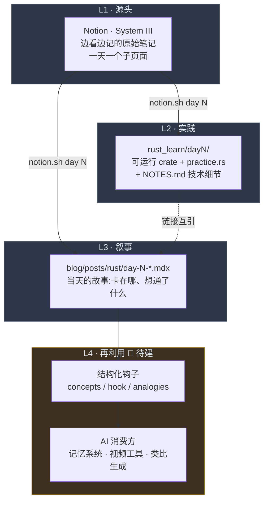
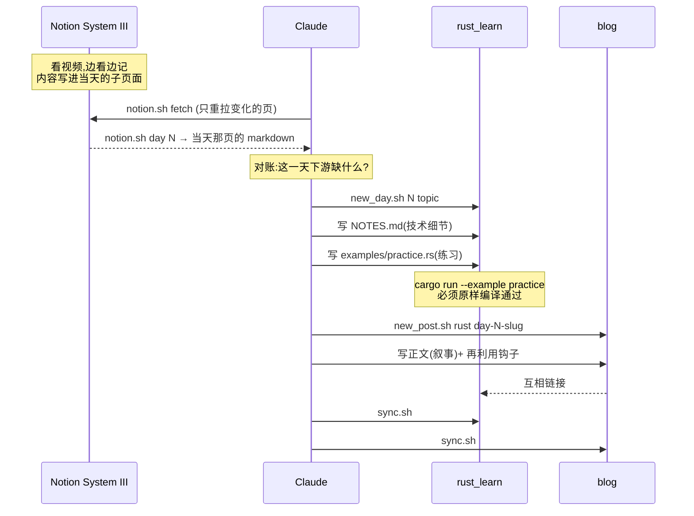

# 每日学习管道 · 架构说明

> 这份文档说的是**为什么**存在这条管道,以及它由哪几层构成。
> 「博客怎么用」在 [README.md](./README.md),「Rust 怎么学」在 [rust_learn](https://github.com/RoddyH17/rust_learn)。

---

## 1. 为什么存在

这条管道不是为了「把笔记同步到三个地方」。同步只是副产品。真正的目标有两个:

**① 让 AI 拥有一套关于「我在学什么」的记忆系统。**
AI 需要知道我每天在学什么、卡在哪、想通了什么,才能在后续对话里接得上,而不是每次
从零问起。散落在 Notion 里的原始笔记做不到这件事——它没有结构,没有时间轴,也没有
「这一天到底完成了没有」的判定。

**② 让每天的知识变成可再利用的素材。**
现在有大量 AI 视频/内容工具。我希望能灵活调用自己每天的动态,并且**直接从博客就能
看出当天的亮点与特色**。

> 例:今天学了 Rust 的 Ownership。这套抽象范式能不能映射到生活里的例子,做成一个
> 更好懂的 exemplify?「所有权只能有一个持有者,转移之后原持有者失效」——这跟房产
> 过户、跟借书证、跟接力棒有什么异同?
>
> 这类玩法还有很多,但前提是**每天的材料必须以机器能直接消费的形态存在**。

所以有一条贯穿全文的原则:

> **这条管道的产物,首要读者是 AI,其次才是人。**

人读的部分(博客正文)已经有了。缺的是 AI 读的部分——这就是下面 L4 那一层。

---

## 2. 四层架构



| 层                         | 是什么                                                           | 按什么组织          | 状态        |
| -------------------------- | ---------------------------------------------------------------- | ------------------- | ----------- |
| **L1** Notion · System III | source of truth。边看视频边记,内容首先落在这里                   | 按天,一天一个子页面 | ✅ 在用     |
| **L2** rust_learn          | 实践产物:可运行 crate、`practice.rs` 练习集、`NOTES.md` 技术细节 | 按天 `dayN/`        | ✅ 在用     |
| **L3** blog                | 叙事层:当天的故事、卡点、反思。公开可读                          | 按天 `day-N-*.mdx`  | ✅ 在用     |
| **L4** 再利用层            | 机器可读的每日索引与亮点抽取,喂给 AI                             | 按天,结构化字段     | 🚧 **待建** |

### 三层现在共用一条切分轴:天

**2026-08-06 起,Notion 也按天切**——Roddy 把 Day 1/2/3 拆成了 System III 下的三个
子页面。三层从此同构,`audit` 之所以能做,就是因为三边可以逐天对齐。

原先 L1 是按主题(章/节)切的,理由写在
[`src/content.config.ts`](./src/content.config.ts) 里(research 集合那段注释):

> posts 是时间流、是写完就定稿的;research notes 是一个会被反复修订几个月的矩阵。

按那个分类,System III 更像后者,所以本文档原先建议**不要**按天拆。改了之后换来的是
一个明显更结实的 join key(见下一节),这笔交易是划算的。

**但代价要记在这里,免得以后忘**:到第 60 天,「借用规则怎么写来着」会变成
「那是第几天学的来着」。等日页多到查不动时,解法是在父页维护一份**主题索引**
(概念 → 哪一天),而不是把日页再拆回主题结构。

---

## 3. 页面即日界

三层之间的关联键是**页面**:System III 下每个子页面就是一天。

```
9️⃣ System III —— Rust & Distributed Principles
 ├─ Day1: Setup
 ├─ Day2: Mutability and Variables
 ├─ Day3: Ownership and Memory
 └─ Day4: Slice, Char, Enum
```

### 契约

1. **子页标题里的 `Day N` 就是日号**,用 `/Day\s*(\d+)/i` 解析。不硬编码 page id ——
   新增一天不用改代码。
2. **日号只在章内唯一。** 过渡到中级时会开 Chapter 2 / Chapter 3,**每章都重新从
   Day 1 开始**。所以真正的标识是 **(章, 日)**,不是单独的日号。命令行上写
   `day 2.3` = 第 2 章的 Day 3;第 1 章可省略,直接 `day 3`。
3. **章的发现是递归的**:标题匹配 `/Chapter\s*(\d+)/i` 的子页是章容器,继续往里找日页;
   否则就是日页。**当前布局里日页直接挂在 System III 下**(Chapter 1 只是父页正文里的
   一个标题,没单独成页),这种情况归第 1 章。
4. 递归拉取时**遇到 `child_page` 必须停**。子页各自落一个缓存文件,内联进父页会让
   同一份内容存两遍。
5. **父页正文里的内容 = 尚未被任何一天认领。** 这是「写在 Notion 里但永远不会流向
   下游」那类漏的唯一藏身处,`audit` 会单独报。

### 为什么这比原来的 `(DayN)` 标记好

原方案是在标题后缀上打 `(DayN)` 字符串标记,再用正则切片。它的致命弱点是**要靠人
手打全**:改版前 43 个标题只有 7 个带标记,1.3 和 1.4 两整节从没有任何一天认领。
下游明明做对了(`day3/NOTES.md` 覆盖了整个 1.2),上游的标记却没跟上。

改成页面之后:

- 切片器不用写了,连同它全部的边界情况(标记管辖到哪、跨节怎么算)一起消失
- 不存在「打漏标记」这种失败模式——内容放进哪一页,就属于哪一天
- 取数还更省:按页比对 `last_edited_time`,只重拉变化的那一页

### 往 Notion 里写什么 —— 两条硬规则

**① 不放练习。** 练习在代码里做(`examples/practice.rs`),Notion 里再放一份就是重复。
往 Notion 放的是:解释、中英文对照解释、细致知识点、对已有笔记的总结。
🌟 分级同理,只属于 `practice.rs`。

**② 一个大标题,底下逐条列重点。** 不要 `###` / `####` 堆成多层树 ——
用加粗编号引导句 + 代码 + 表格把要点一条条列出来。对齐现有 Day 2 / Day 3 的排版。

中英文分工沿用既有习惯:**英文承载 The Rust Book 的参考文本,中文承载他自己的理解。**

### 读和写走两条不同的路

| 方向             | 用什么                                                            | 为什么                               |
| ---------------- | ----------------------------------------------------------------- | ------------------------------------ |
| **读**(取数)     | `scripts/notion.sh` + `.env` 里的只读 token                       | 不进上下文,成本固定                  |
| **写**(回写内容) | MCP `notion-update-page`(`insert_content` + `position: end` 追加) | 脚本那个 integration **只读,写不了** |

### 日号口径:以 Notion 为准

**Notion 是日号的权威**——Roddy 每天在 System III 下更新当天的学习情况,从
Chapter 1 的 Day 1 开始排。下游(博客、rust_learn)向它对齐。

三层已于 2026-08-06 对齐:博客的 Day 1 / Day 2 按 Notion 的切分重新分配过
(变量与元组数组归 Day 1,返回值与循环归 Day 2),Day 3 的引用一节并入所有权。
文件名保持不变以免已发布 URL 断掉 —— 代价是 `day-2-variables` 这个 slug 已经不
描述它的内容了。

### ⚠️ 待决:第 2 章的目录约定

第 2 章会重新从 Day 1 开始,而 `rust_learn/day1/` 已经被第 1 章占了。到时候需要一个
新约定(`c2day1/`?继续全局编号?)。**`audit` 不替人发明约定**——遇到第 2 章的日页会
直接报「尚无目录约定,需先决定」,而不是猜一个然后对错地方。

---

## 4. 一天的生命周期



Day 3 经历过一次**主题重定义**:最早是「结构体与方法」(`day3/structs/` +
已发布的 `day-3-structs.mdx`),2026-08-06 改成了「所有权与内存」,旧的 cargo 项目和
旧文章都已删除。这类改写正是对账表存在的理由 —— 一天的定义变了,四项里就有几项会
悄悄掉队,而 `audit` 会把它们逐条报出来。

---

## 5. 「一天算完成」的定义

四项齐全才算完成。缺任何一项,这一天就是半成品:

| 检查项       | 判据                                                                                |
| ------------ | ----------------------------------------------------------------------------------- |
| **Notion**   | 当天的内容都在自己的子页面里,父页正文没有遗留                                       |
| **NOTES.md** | `rust_learn/dayN/NOTES.md` 覆盖了那一页的每个小节                                   |
| **practice** | `dayN/<topic>/examples/practice.rs` 存在,且 `cargo run --example practice` 原样通过 |
| **blog**     | `src/content/posts/rust/day-N-*.mdx` 存在,已发布(无 `draft: true`)                  |

跑 `./scripts/notion.sh audit` 就能得到下面这张表 —— 不要手抄,它会过期。

### 现状实录(2026-08-06 收工,`audit` 实际输出)

|          | Notion 子页                       | NOTES.md | practice    | blog |
| -------- | --------------------------------- | -------- | ----------- | ---- |
| C1·Day 1 | ✅ Day1: Setup                    | ✅ 3 节  | — 无练习    | ✅   |
| C1·Day 2 | ✅ Day2: Mutability and Variables | ✅ 15 节 | ✅ 编译通过 | ✅   |
| C1·Day 3 | ✅ Day3: Ownership and Memory     | ✅ 12 节 | ✅ 编译通过 | ✅   |
| C1·Day 4 | 🚧 Day4: Slice, Char, Enum        | ❌       | ❌          | ❌   |

Day 1–3 四项齐全。Day 4 是明天的活:切片(从 Day 3 移出)、`char` 与字符串、枚举。

`audit` 的两条硬规则:

- **查文件系统,不查 git。** 「存在但未提交」和「不存在」是两种状态,分开报。
  (写这份文档时我用 `git ls-files` 判过一次,把未追踪的 `day3/ownership/` 整个漏了)
- **不做假的覆盖率。** NOTES.md 的英文标题和 Notion 的中英夹杂标题字面对不上,
  做相似度匹配只会给出虚假的精确感。并排列出两边小节,标「需人工判断」,不出百分比。

`practice` 一项**真的跑 `cargo build --example practice`**,不只查文件存在 ——
这是「原样可编译」那条铁律唯一可靠的检查方式。

表里最后一行是最容易被忽略的一种漏:内容写在 Notion 里了,但**从没有任何一天认领它**,
于是它永远不会流向下游。1.3 切片和 1.4 流程控制现在就卡在这儿。

---

## 6. L4 · 再利用层(🚧 提案,未实现)

前三层都是「存放」。第四层是「抽取」——它要回答的问题是:

> **每天除了笔记和文章,还应该额外产出什么,才能让 AI 直接消费?**

### 形状:博客文章 frontmatter 上的再利用钩子

```yaml
---
title: Day 3 · Ownership — 谁负责释放这块内存
pubDate: 2026-08-06
categories: [rust]
mood: [sorge, frage]

# ── L4 再利用钩子 ──────────────────────────────
# 当天的核心抽象。AI 用它判断"这天讲了什么"
concepts: [ownership, move, borrow, NLL, dangling-reference]

# 一句话说清当天最反直觉的点 —— 视频/类比生成的种子
hook: '把一个变量赋值给另一个,原变量当场失效 —— 赋值是转移,不是拷贝'

# 已经想到的生活类比。可以留空,由 AI 补
analogies:
  - '房产证只能有一个持有人;过户之后,原持有人不再有权处置那套房'
  - '借出去的书:借阅期间你不能再借给第二个人,也不能把书卖掉'
---
```

### 为什么放 frontmatter,而不是单独的 index.json

沿用 research 集合已经确立的模式(见 `src/content.config.ts` 里 `sources[]` /
`deepwiki[]` 那段注释):**出处放 frontmatter,正文改了也不脱节。**

具体到这里:

- 博客本来就要按天写。钩子跟着文章走,**一次编辑同时喂人和喂 AI**
- 不产生第二个需要同步的地方——多一个 index.json 就多一处会漂移的真相
- Astro 的 `getCollection('posts')` 一次调用就能拿到全部钩子,渲染和消费都免费

### 这一层解锁什么

| 能力                           | 靠哪个字段                           |
| ------------------------------ | ------------------------------------ |
| AI 知道我这周学了什么          | `concepts` 按天聚合                  |
| 「今天这个概念,能类比成什么」  | `hook` 当种子,`analogies` 当已有积累 |
| 生成短视频脚本 / 讲解稿        | `hook` + 正文 + `practice.rs` 的题目 |
| 博客上直接看出当天亮点         | `hook` 渲染成文章卡片的副标题        |
| 找出「学过但从没复用过」的概念 | `concepts` 出现过但 `analogies` 为空 |

> **状态:提案。** 本文档只立靶心,`src/content.config.ts` 尚未改动,现有文章也还
> 没有这些字段。

---

## 7. 脚本清单

### blog 仓库(`~/blog`)

| 脚本                                  | 职责                                                              | 状态 |
| ------------------------------------- | ----------------------------------------------------------------- | ---- |
| `new_post.sh <类别> <slug> [标题]`    | 新建博客草稿(默认 `draft: true`)                                  | ✅   |
| `new_research.sh <protocol> <slug> …` | 新建协议研究笔记(research 集合)                                   | ✅   |
| `sync.sh ["msg"]`                     | commit + push,触发 GitHub Actions 部署                            | ✅   |
| `scripts/deepwiki.sh`                 | DeepWiki 检索层(research 管道用)                                  | ✅   |
| `scripts/notion.sh`                   | **Notion 取数与对账**:`list` / `fetch` / `day` / `diff` / `audit` | ✅   |
| `scripts/notion_sync.py`              | 上者的实现:拉取 + block→markdown + 对账(仅标准库)                 | ✅   |

```bash
./scripts/notion.sh list              # 列出章与日页(自动发现,加一天/一章都不用改代码)
./scripts/notion.sh fetch [--force]   # 只重拉 last_edited_time 变了的页
./scripts/notion.sh day 3             # 打印 Day 3 那页;跨章重号写 day 2.3
./scripts/notion.sh diff              # 与上次拉取相比,哪些标题增删了
./scripts/notion.sh audit [N]         # 四层对账;不带参数则全部 + 父页未认领内容
```

缓存落在 `.cache/notion/`(已 gitignore):每页一份 `.md`、一份 `.json`(原始 block
树,改转换器时不必重新拉取)、一份 `.prev.md`(供 diff),外加 `meta.json`。页面改名
会换 slug,`fetch` 会自动清掉改名遗留的孤儿文件。

`audit` 除 `fetch` 外**不需要网络**——它读缓存 + 查本地文件系统。

### rust_learn 仓库(`~/rust_learn`)

| 脚本                     | 职责                                                 | 状态 |
| ------------------------ | ---------------------------------------------------- | ---- |
| `new_day.sh <N> [topic]` | 建 `dayN/` + cargo 项目 + practice 骨架 + NOTES 模板 | ✅   |
| `sync.sh ["msg"]`        | commit + push                                        | ✅   |

### 一条贯穿的原则:检索层不是结论层

这句话已经写在 `scripts/deepwiki.sh` 顶部,对 Notion 检索层同样成立:

> DeepWiki 是检索层,不是结论层。它答出来的东西必须回原始源码核对再写进笔记。

对应到这条管道——**切片、对账、diff 是确定性的,交给脚本;「这一节属于哪天」
「哪道题值得抄进 practice.rs」需要判断,不能脚本化。** 混淆这两者,就会得到一个
看起来自动、实际上悄悄写错的管道。

---

## 8. 已知约束

### 认证:已打通(2026-08-06)

Notion MCP 走的是 Claude 这边的 OAuth,脚本用不了。因此建了一个 internal
integration,凭据放在 `~/blog/.env`(已被 `.gitignore` 忽略):

```
NOTION_TOKEN=ntn_...
NOTION_SYSTEM_III_ID=3995432c-88e6-80cf-8319-d77f1bc72634
```

**权限范围:只共享了 System III 一个页面**(2026-08-06 用 `/v1/search` 验证,
返回且仅返回该页)。将来要接别的页面,得在 Notion 里逐个把页面共享给这个
integration——父页共享会级联到子页。

连通性验证结果:整页递归走完 **444 个 block,29 次 API 调用**,43 个标题层级完整。

> **为什么这件事值得做:** MCP 的返回一定会进上下文。System III 现在 50K 字符
> ≈ 15–20K tokens,每次取数都要付,而且逐日增长。脚本落盘则是零上下文成本,
> 之后只读需要的切片(单天约 600 tokens),**不随页面增长**。

### 解析:REST API 返回结构化 block,不是 HTML

用 `/v1/blocks/{id}/children` 递归拉取,拿到的是 typed block JSON,代码块是独立的
`code` 类型、`plain_text` 原样保留。所以**在这条路径上不存在剥标签/反转义的问题**,
不需要任何 HTML 清洗。已验证 `if n < 10 && n > -10` 在 67 个 code block 中完整保留。

⚠️ 但那个坑对**另一个源**依然成立:抓 [Rust By Practice](https://practice-rust-zh.beatai.org/)
的题目时拿到的是 HTML,**必须先剥标签再反转义实体**,顺序反了 `<[^>]+>` 会把
`if n < 10 && n > -10` 整段吃掉。两个源两套处理,别混。

### 解析:图片 URL 必须剥掉签名串

Notion 托管的图片是 S3 签名链接,**每次拉取签名都不一样**。若原样写进缓存,每跑一次
`fetch`,`diff` 就会把这些行全报成「改动过」(Day3 有 7 张图 = 每次 7 行假差异,
`diff` 永远安静不下来)。

所以转换时剥掉 `?` 后的查询串,只留稳定路径,并在下一行留 `<!-- notion-block: <id> -->`。
代价是缓存里的图链**不能直接访问**;要真的用图,拿 block id 回 Notion 换新链接。

### 解析的真实工作量(已完成)

REST API 不返回 markdown,转换器要自己写:16 种 block、富文本标注(inline code 出现
210 次,最高频)、`has_children` 递归、表格的 `has_column_header`、以及遇到
`child_page` 必须停止递归。实际约 330 行,落在 `scripts/notion_sync.py`,仅用标准库。

### 检索:wiki 型 database 的搜索是坏的

Roddy's Wiki 是 wiki 型 database,`notion-search` 带 `data_source_url` 参数时
**恒返回空结果**。要用 `notion-query-data-sources` 走 SQL:

```
collection://1d35432c-88e6-80f2-9c31-000bb9d9e9f0
```

(2026-08-06 验证)

### 体积:拆页之后不再是问题

拆页前 System III 是一整页 50K 字符,单次 `notion-fetch` 就超出一次工具响应上限。
拆成日页之后,最大的一页(Day3)是 12.7K 字符,而且 `fetch` 按页比对
`last_edited_time`,平时只重拉当天那一页。

**Token 账**:改版前每次取数 ≈ 15–20K tokens 且逐日增长;现在 `notion.sh day 3`
读一页缓存,成本固定,且不随全库增长。

---

## 9. 下一步

1. ~~`scripts/notion.sh` 取数层~~ —— ✅ 已完成
2. ~~定日号口径~~ —— ✅ 以 Notion 为准,(章, 日) 复合标识
3. ~~`audit` 四层对账~~ —— ✅ 已完成
4. ~~修 `day3/.../practice.rs` 的编译错~~ —— ✅ 已修(`audit` 现在报编译通过)
5. **用管道把 Day 3 补完** —— 写 `day-3-ownership.mdx`,这是第一个真实用例
6. 给 1.3 / 1.4 认领归属(移进某一天的子页,或新建 Day 4)
7. 提交 `day3/ownership/`(`audit` 报它未被 git 追踪)
8. L4:改 `src/content.config.ts` 加钩子字段,回填 Day 1–3
9. 第 2 章开始前,定 `rust_learn` 的跨章目录约定(见 §3 待决)

---

_最后更新:2026-08-06_
