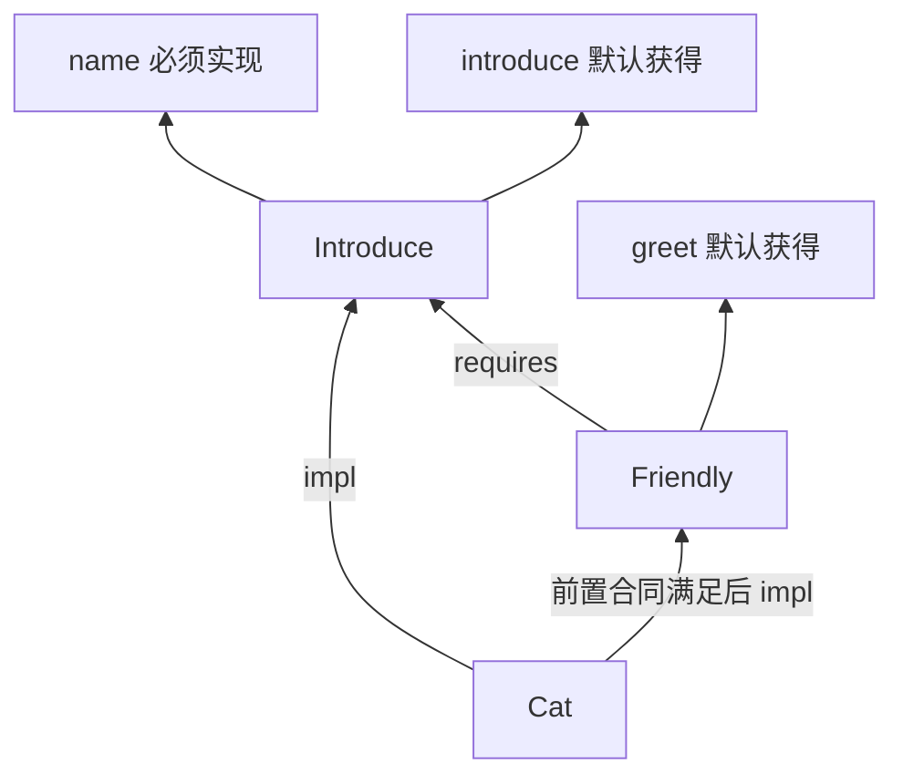
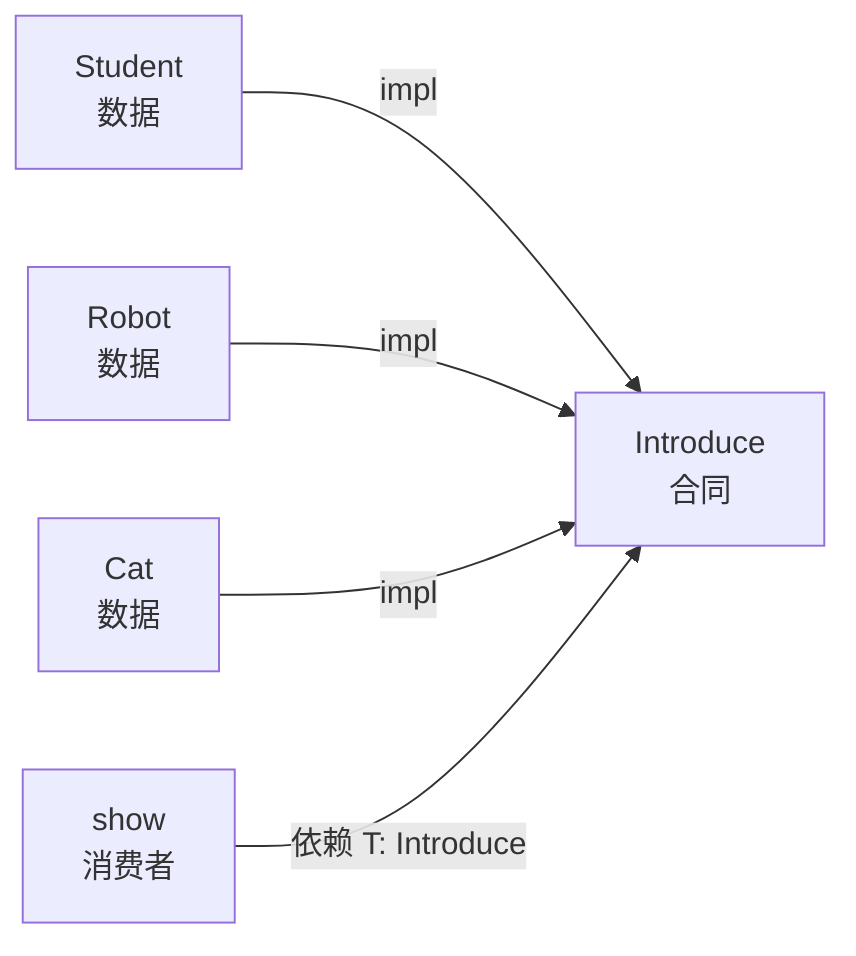
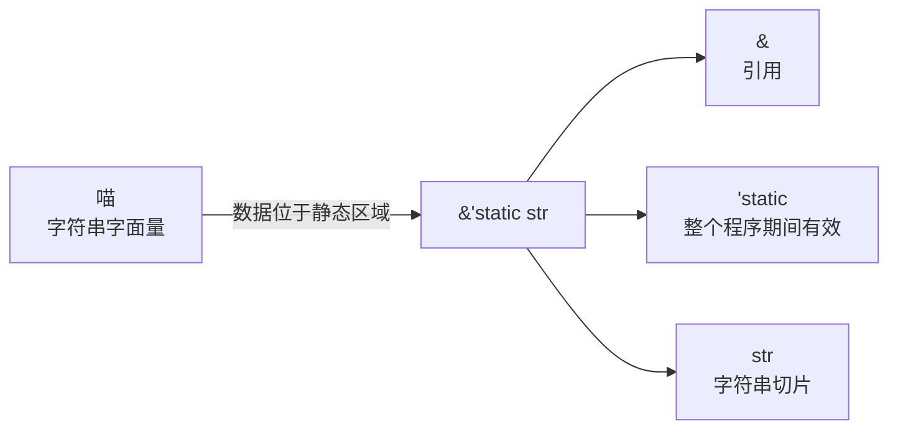
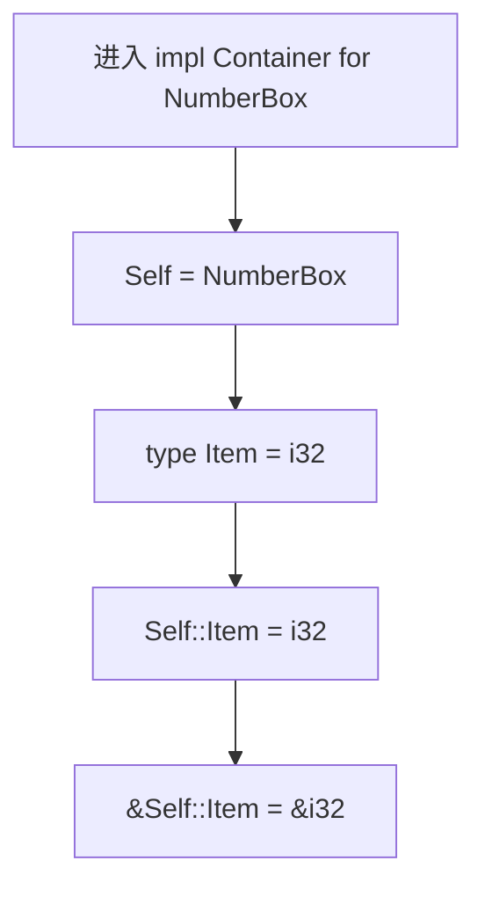

# Traits_v1：一次真实学习之后的 Trait 地形

> 这不是对 **11 trait 语法** 的改写或替代。
>
> `11 trait 语法` 保存学习前生成的知识脚手架；`Traits_v1` 保存代码、报错、追问和反思共同留下的真实地形。前者告诉我“这里应该有什么”，后者记录“我实际上在哪里转弯、哪里打结、哪里只是暂时看不清”。

## 两个坐标轴：type 与 layer

这份文档继续使用 `type: vibelearn`，因为它来自沿代码和练习展开的一整次主动学习，而不是由单个症状独立生成的一篇 Knot。

新增的 `layer` 回答另一个问题：这份知识位于哪一层？

| 元数据  | 回答的问题                                   | 本文取值                                     |
| ------- | -------------------------------------------- | -------------------------------------------- |
| `type`  | 这份文档以什么方式形成？                     | `vibelearn`                                  |
| `layer` | 它是学习前的生成框架，还是亲历后沉淀的坐标？ | `the real`                                   |
| `field` | 它落在哪些知识场域？                         | trait、receiver、泛型与架构                  |
| `tags`  | 从这里继续走的动作是什么？                   | distinguish / trace / map / compare / locate |

因此，同一个概念可以同时拥有两层文档：

```text
11 trait 语法.md   → type: vibelearn, layer: generated
Traits_v1.md       → type: vibelearn, layer: the real
```

`generated` 不是错误答案，`the real` 也不是更长的答案。它们承担不同职责：


## Knot 的操作性定义

Knot 不是“我问过的问题”，也不等于“很难的知识点”。问题只是观察认知阻力的窗口。

在这份学习记录中，一个问题只有同时满足下面的大部分条件，才被归为 Knot：

1. 补充一个术语定义后，困惑仍然存在；
2. 困惑来自两个已有模型之间的冲突，而不只是陌生符号；
3. 解开后会改变我阅读其他代码的方式，而不只修复当前一行；
4. 同一结构预计会在后续模块、项目或其他语言中再次出现；
5. 它要求重画关系、权限或依赖方向，而不只是做一次类型替换。

反过来，非 Knot 通常具有下面的形状：

- 一个新符号尚未与旧概念对接；
- 一个返回类型可以通过局部替换确定；
- 一条状态流或调用流画清楚后，困惑就消失；
- 它提升语法流畅度，但没有迫使原有认知模型重组。

所以：

> Knot 是认知模型之间持续存在的结构性拉扯；非 Knot 是尚未完成的局部映射。

一个问题可能不是 Knot；多个不同问题也可能共同暴露同一个 Knot。非 Knot 并不低级，它们是语言逐渐澄明所必需的接口工作，只是不应被包装成虚假的“深刻问题”。

---

## Knot 类：改变了认知结构的结

### Knot 1｜签名即语义：同一函数体不等于同一操作

**触发证据**：`value()` 与 `finish()` 都只有 `self.value`，为什么功能不同？

```rust
fn value(&self) -> i32 {
    self.value
}

fn finish(self) -> i32 {
    self.value
}
```

表面矛盾是：

```text
函数体相同 + 返回数字相同
为什么调用后的行为不同？
```

真正的结位于“功能由什么决定”这个旧模型。原来的注意力集中在函数体；Rust 迫使我把函数签名也看成行为本身。

| receiver    | 方法获得的权限       | 调用后的对象状态         |
| ----------- | -------------------- | ------------------------ |
| `&self`     | 临时共享借用         | 原对象仍然可用           |
| `&mut self` | 临时独占借用         | 借用结束后原对象仍然可用 |
| `self`      | 取得整个对象的所有权 | 原绑定不能再使用         |

```mermaid
stateDiagram-v2
    [*] --> Owned: Counter::new()
    Owned --> BorrowedRead: value(&self)
    BorrowedRead --> Owned: 借用结束
    Owned --> BorrowedWrite: reset(&mut self)
    BorrowedWrite --> Owned: 借用结束，状态已改变
    Owned --> Consumed: finish(self)
    Consumed --> [*]
```

当前字段是 `i32`，而 `i32: Copy`，因此两种方法都能产生一个 `i32`，把所有权差异遮住了。如果字段换成 `String`，差异会立即显形：

```rust
fn text(&self) -> &String {
    &self.text
}

fn finish(self) -> String {
    self.text
}
```

这次解结形成的长期判断是：

> 阅读方法时，不能只问“里面做了什么”，还要问“它取得了什么权限，调用后什么仍然有效”。

它会在 builder、iterator 消费操作、状态机、锁守卫和异步任务句柄中再次出现。

#### 与 generated 文档的校准

**11 trait 语法** 已经列出了 receiver 四种形态，但它给的是分类表。真实学习补上的不是第五种 receiver，而是更重要的一层：**receiver 是状态转换协议的一部分**。

### Knot 2｜方法存在不等于 Trait 成立：Rust 检查显式关系

**触发证据**：`Cat: Introduce is not satisfied` 出现后，最初设想是在 `impl Friendly for Cat` 中增加一个 `cat_introduced()`。

```rust
trait Friendly: Introduce {
    fn greet(&self) -> String {
        format!("{}，欢迎你！", self.name())
    }
}
```

这里暴露出的结不是“少写了哪个函数”，而是两种能力判断模型冲突：

```text
旧模型：对象只要有意思相近的方法，就算具备能力
Rust：必须存在明确的 impl Trait for Type 关系
```

`Friendly: Introduce` 表示能力合同之间的前置关系。解决它需要补上 Rust 真正要求的证明：

```rust
impl Introduce for Cat {
    fn name(&self) -> &str {
        "小猫"
    }
}

impl Friendly for Cat {}
```

关系结构是：



`cat_introduced()` 即使名字或含义相似，也不会建立 `Cat: Introduce`。Rust 检查的是声明过的合同关系，不是运行时根据方法形状猜测。

这也是 Rust 与默认 Python 鸭子类型的重要分界：能力不是“调用时刚好找到了方法”，而是编译器可以提前验证的关系。

#### 与 generated 文档的校准

**11 trait 语法** 中的 supertrait 规则写成了“实现 Pet 前必须先实现 Animal”。真实报错进一步说明：**前置能力必须由真正的 trait impl 满足，不能由同名方法、相似方法或另一个 impl 块代替。**

这个 Knot 会在 `Display`、`Iterator`、`From/Into`、`Send/Sync` 以及大量 E0277 报错中再次出现。

### Knot 3｜低耦合不是关键字，而是依赖方向

**触发证据**：学习过程中开始追问 `impl Trait for Struct` 为什么使 Rust 低耦合，并把自己的理解写成“数据—合同—连接—消费者”。

这个结的重要性在于，它从语法越过了架构：到底是哪一步减少了耦合？

```rust
struct Student {
    name: String,
}

trait Introduce {
    fn name(&self) -> &str;

    fn introduce(&self) -> String {
        format!("你好，我是 {}", self.name())
    }
}

impl Introduce for Student {
    fn name(&self) -> &str {
        &self.name
    }
}

fn show<T: Introduce>(value: &T) -> String {
    value.introduce()
}
```



降低耦合的不是 `impl` 自动施加了某种架构魔法，而是消费者主动选择：

```text
依赖 Student 这个具体类型  ✗
依赖 Introduce 这份能力合同 ✓
```

增加 `Teacher` 时，只需为它实现 `Introduce`；`show` 的源码通常不需要修改。

这份理解还需要两个边界：

1. Java interface 同样可以让消费者依赖接口，所以低耦合不是 Rust 独有；
2. Python 鸭子类型也能减少名义类型依赖，但默认把部分错误推迟到实际执行路径。

Rust 的特殊组合是：显式 trait impl、编译期 bound 检查、可选择静态或动态分发，以及 coherence 对实现唯一性的限制。

#### 与 generated 文档的校准

**11 trait 语法** 主要解释 trait 的声明、约束和实现规则；真实学习第一次把这些规则压缩成了一个可以用于架构判断的模型：

```text
Type 负责数据
Trait 负责合同
impl 负责提供实现证据
Consumer 负责选择依赖方向
```

这也是本次学习最有价值的个人坐标。

### Knot 4｜抽象不是“编译器一无所知”，而是消费者承诺只依赖合同

**触发证据**：最初难以理解“函数要求参数具备某种能力”。如果 `T` 的具体类型未知，为什么函数还能调用方法？

```rust
fn show<T: Introduce>(value: &T) -> String {
    value.introduce()
}
```

`T: Introduce` 同时做两件事：

1. 限制哪些具体类型可以进入函数；
2. 向编译器证明函数体可以调用 `Introduce` 的方法。

```text
调用 show(&student)
        ↓
推导 T = Student
        ↓
验证 impl Introduce for Student 是否存在
        ↓
允许 value.introduce()
```

这里的结构性张力是：消费者源码不依赖具体类型，但编译器在每次静态调用中仍能知道具体 `T`，并进行单态化。

因此更准确的模型不是：

```text
泛型 = 谁都不知道 T 是什么
```

而是：

```text
消费者只使用 Trait 公开的能力
编译器仍可在具体调用点知道 T
```

| 写法                 | 当前单参数例子的依赖        | 分发 |
| -------------------- | --------------------------- | ---- |
| `T: Introduce`       | 显式泛型约束                | 静态 |
| `where T: Introduce` | 同一约束移到 `where`        | 静态 |
| `&impl Introduce`    | 参数位置的简写              | 静态 |
| `&dyn Introduce`     | 隐藏具体类型的 trait object | 动态 |

前三种只在当前单参数结构中可视为同一核心要求，不能推广成“任何场景都完全等价”。例如两个独立 `impl Trait` 参数可以是不同具体类型，而同一个 `T` 会把两者约束为相同类型。

#### 与 generated 文档的校准

**11 trait 语法** 已经指出前三种走单态化、`dyn` 走动态分发。真实学习补上的中间桥梁是：**trait bound 是消费者可用的编译期证据，不是在运行时给 T 添加能力。**

这个 Knot 将在 **14 dyn 与 trait object** 中进一步展开：静态信息被隐藏后，哪些信息需要搬进胖指针和 vtable。

---

## 非 Knot 类：需要完成的局部映射

这些问题确实推动了学习，但目前不需要被提升成独立 Knot。它们通过符号拆解、具体类型替换或状态流程就能够稳定解决。

### 符号映射｜`&'static str`

**分类：非 Knot。** 陌生点来自生命周期符号尚未和引用类型完成对接。



```rust
fn sound(&self) -> &'static str {
    "喵"
}
```

这里返回的字面量不借用 `self`。`&'static str` 也不表示拥有字符串；拥有堆上字符串的常见类型仍是 `String`。

这条困惑在拆开符号后已经消失，没有继续与其他模型发生冲突，因此目前不构成 Knot。

### 类型流｜赋值表达式为什么得到 `()`

**分类：非 Knot。** 问题可由函数签名和代码块最终表达式的类型流直接消解。

```mermaid
flowchart LR
    A[fn reset -> i32] --> B[函数体必须产生 i32]
    C[self.value = 0;] --> D[赋值表达式类型为 unit ()]
    B --> E{类型一致吗?}
    D --> E
    E -->|否| F[expected i32, found ()]
```

只修改状态时：

```rust
fn reset(&mut self) {
    self.value = 0;
}
```

修改并返回数值时：

```rust
fn reset(&mut self) -> i32 {
    self.value = 0;
    self.value
}
```

这次澄清的局部规则是：Rust 代码块有类型，最后一个无分号表达式决定返回值。

### 调用流｜定义 `reset()` 不等于执行 `reset()`

**分类：非 Knot。** 画出调用顺序后，状态变化完全确定。


“method is never used” 表示方法已定义，但当前代码没有调用。它不是说方法实现错误，也不会因为定义存在就自动改变对象。

### 类型替换｜`Self::Item` 与 `Self::Product`

**分类：非 Knot。** 当前困难可以用“进入具体 impl 后逐项替换”稳定解决。



`Self::Item` 是关联类型，不是一个名为 `Item` 的对象：

```rust
trait Container {
    type Item: Display;
    fn item(&self) -> &Self::Item;
}
```

`Display` 是 `std::fmt::Display` trait；它要求实现者选定的 `Item` 能够使用 `{}` 格式化。

同样：

```rust
impl Maker for Bakery {
    type Product = String;

    fn make(&self) -> Self::Product {
        String::from("一个面包")
    }
}
```

可以替换为：

```text
Self = Bakery
Self::Product = String
make() 必须返回拥有所有权的 String
```

原先尝试的 `&self.value()` 只是局部类型和对象模型没有对齐：`Bakery` 没有 `value()`，而 `&...` 产生引用，不符合返回 `String` 的签名。

但这里存在一个**尚未形成的潜在 Knot**：关联类型由实现方选择，而泛型参数通常由调用方选择。当前只学会了替换语法，尚未通过 API 设计真正感受到“类型选择权”带来的差异。它预计会在 `Iterator<Item = T>`、`IntoIterator` 和自定义库接口中重新出现。

---

## 与 generated《11 trait 语法》的逐项校准

校准不是把学习后的问题堆回原文，而是比较“原文提供了什么结构”与“真实学习把结构推进到了哪里”。

| generated 内容              | the real 证据                                | 当前把握                       | 仍缺的经验                                           |
| --------------------------- | -------------------------------------------- | ------------------------------ | ---------------------------------------------------- |
| trait = 方法签名 + 默认实现 | `Speak`、`Introduce`、`Greeting` 均已实现    | 能独立完成基础定义与实现       | 多 trait 同名方法的消歧                              |
| 必须方法与默认方法          | `Student` 复用默认实现，`Robot` 覆盖         | 稳定                           | 默认方法演化对公共 API 的影响                        |
| receiver 四种形态           | 增加 `reset`，比较 `value` 与 `finish`       | 已从语法表推进到所有权状态转换 | consuming builder、guard、iterator 中的设计选择      |
| supertrait                  | 修复 `Cat: Introduce` E0277                  | 能沿前置合同定位缺失 impl      | 多层 supertrait 与 `Send + Sync` 组合                |
| 四种 trait bound            | 能解释 `T: Introduce` 的检查流               | 简单函数中可用                 | 多参数 `impl Trait`、返回 `impl Trait`、复杂 `where` |
| 关联常量与关联类型          | 完成 `BoolBox`、`Maker::Product`             | 能在具体 impl 中做类型替换     | 关联类型与泛型参数的选择权差异                       |
| blanket impl                | 能读懂 `impl<T: Introduce> ShortLabel for T` | 识别级                         | 独立设计、重叠实现和 coherence 冲突                  |
| orphan rule 与 newtype      | 能说明为什么包一层 `Words`                   | 识别级                         | 给外部类型实现外部 trait 时亲历编译错误              |
| 单态化                      | 知道泛型调用保留具体 `T`                     | 概念级                         | 代码体积、性能、静态分发与 `dyn` 的实测比较          |
| `dyn Trait`                 | 能与前三种静态写法区分                       | 入口级                         | trait object 布局、object safety、异质容器           |

这张表说明：第一遍学习已经建立了 trait 的基本可用模型，但 generated 文档后半段的 coherence、blanket impl、newtype、monomorphization 仍主要是“能认出”，还没有全部成为可独立设计的能力。

## 当前熟练度：不是百分比，而是可做出的动作

### 已经稳定的动作

- 能定义简单 trait，并区分必须方法与默认方法；
- 能为多个具体类型分别编写 `impl Trait for Type`；
- 能根据 `&self`、`&mut self`、`self` 判断调用权限和调用后状态；
- 能给简单泛型函数添加 trait bound；
- 能沿 supertrait 关系找到缺失的前置 impl；
- 能在具体 impl 中把 `Self`、`Self::Item` 替换为具体类型；
- 能判断一个消费者是否依赖具体类型，还是依赖能力合同。

### 已经会用，但仍容易摇晃的动作

- 在返回拥有值与返回引用之间做正确选择；
- 区分参数位置的 `impl Trait` 与显式泛型在复杂签名中的细微差异；
- 修改行为后同步更新测试中的状态预期；
- 把个人反思写成精确的 Rust 术语，而不是“消费 trait”“能力写进类型内部”等近似表达。

### 目前只是识别，还不能视为掌握

- 独立设计 blanket impl，并预判实现重叠；
- 用 orphan rule 判断跨 crate 的实现是否合法；
- 在 newtype、泛型静态分发和 trait object 之间做 API 选型；
- 解释 vtable、object safety 和 trait object 生命周期；
- 根据性能、代码体积与异质存储需求选择 `impl Trait` 或 `dyn Trait`。

## 潜在问题会在哪里重新出现

| 潜在困惑                                     | 预计重新出现的位置                                     | 届时真正解决什么                    |
| -------------------------------------------- | ------------------------------------------------------ | ----------------------------------- |
| `impl Trait` 与 `dyn Trait` 只是两种写法吗？ | **14 dyn 与 trait object**、异质 `Vec<Box<dyn Trait>>` | 静态分发、类型擦除、胖指针与 vtable |
| `Self::Item` 为什么不用 `Trait<T>`？         | `Iterator<Item = T>`、`IntoIterator`、自定义容器 API   | 类型选择权属于实现方还是调用方      |
| 为什么同名方法不能算实现 trait？             | `Display`、`From/Into`、第三方 crate 集成              | 名义合同、coherence 与方法解析      |
| blanket impl 为什么可能挡住以后扩展？        | 库开发、重叠 impl 报错                                 | impl 作为全局资源的代价             |
| `self` 为什么要消耗对象？                    | builder、状态机、iterator consumer、资源句柄           | 用类型和所有权表达“一次性状态转换”  |
| `'static` 是不是让值永远不释放？             | trait object 生命周期、线程任务、`Send + 'static`      | 引用有效期、拥有值与线程边界        |
| 编译通过是否代表学习完成？                   | 后续项目修改 API 与状态规则时                          | 测试、Clippy 与行为断言构成的闭环   |

其中最先会被解决的是静态/动态分发问题，因为 **14 dyn 与 trait object** 会直接把 `&dyn Trait` 的运行时表示展开；关联类型的“选择权”问题通常要等到真正使用 `Iterator` 或设计库接口时才会从语法问题变成架构问题。

## 当前代码留下的真实证据

这份 `the real` 层不能只保存一篇顺滑总结，还必须记录当前能力的边界。

已经完成：

- 为 `Duck` 实现 `Speak`；
- 为 `Counter` 增加并调用 `reset(&mut self)`；
- 为 `Cat` 先实现 `Introduce`，再实现 `Friendly`；
- 新建 `BoolBox` 并令 `Item = bool`；
- 完成 `practice.rs` 全部 6 道练习；
- 自己形成“数据—合同—连接—消费者”的架构反思。

尚未闭环：

| 检查                           | 当前结果         | 暴露的边界                           |
| ------------------------------ | ---------------- | ------------------------------------ |
| `cargo check --all-targets`    | 通过，有 warning | `Duck`、`BoolBox` 已定义但未实际构造 |
| `cargo run --example practice` | 6/6 通过         | 基础练习逻辑已完成                   |
| `cargo test`                   | 4 通过，1 失败   | `reset()` 后值为 0，旧断言仍期待 5   |
| `cargo fmt --all -- --check`   | 未通过           | 学习代码尚未统一格式                 |
| 严格 Clippy                    | 未通过           | dead code 与不必要的数值引用         |

失败测试的值流是：

```text
new() = 0
add(5) = 5
reset() = 0
测试仍断言 value() = 5
```

这不是一个新的 Trait Knot，而是一条工程反馈：当实现语义变化时，测试也是系统的一部分，必须同步表达新的不变式。

## 阶段性坐标

这次学习后，我对 trait 的把握可以压缩成四句话：

1. Trait 是能力合同，不是字段继承；
2. `impl Trait for Type` 是明确的实现证据，不是相似方法的猜测；
3. receiver 决定方法取得的权限，也决定调用后的对象状态；
4. 低耦合来自消费者依赖合同，泛型约束负责让这种依赖在编译期可检查。

真正形成的个人方法则是：

```text
遇到局部语法困惑 → 拆符号、代具体类型、画值流
遇到持续结构冲突 → 找两个模型在哪里互相拉扯，标记为 Knot
修改实现之后       → 重新运行测试，检查旧不变式是否仍成立
进入后续模块       → 观察同一个 Knot 是否再次浮现并获得新证据
```

这就是 `Traits_v1` 与 generated 文档的差别：它不追求覆盖更多术语，而是保存我已经形成的坐标、仍然模糊的边界，以及未来知识会从哪里再次进入。
